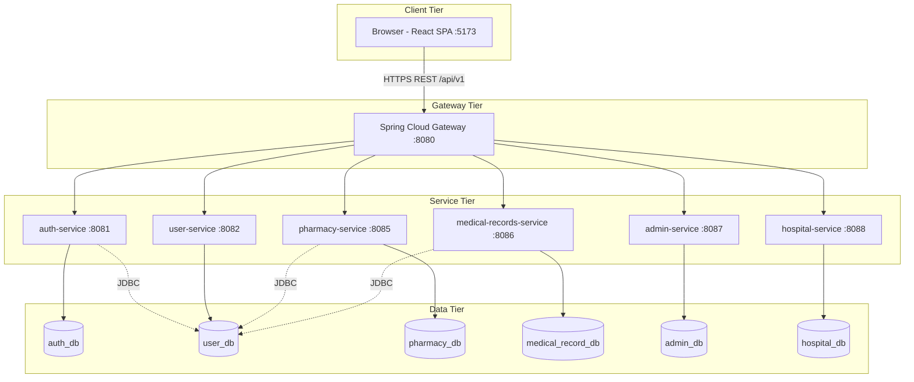
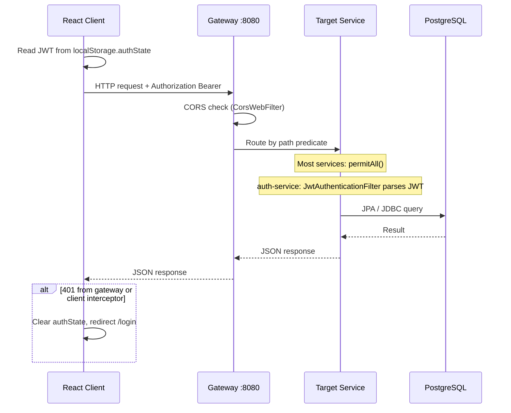
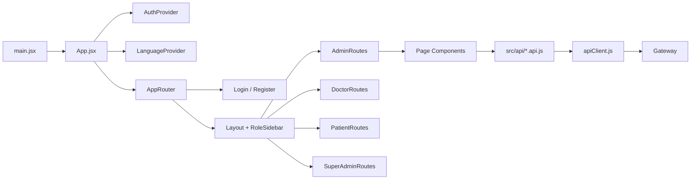
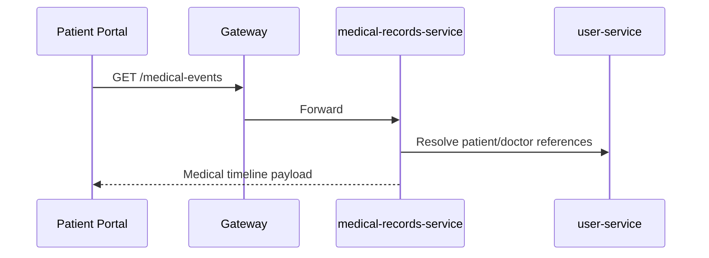
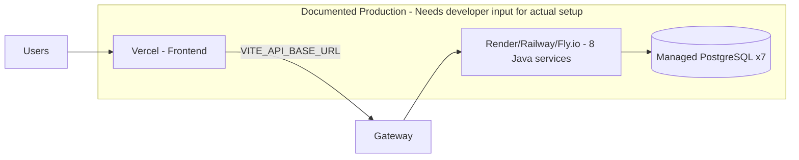

# 3. Project Architecture

## Overall Architecture

TenaLink uses a **microservices architecture** with a **Backend-for-Frontend (BFF) style API gateway**. The frontend is a single React SPA with **role-based routing** to four logical portals. Each domain service follows a **layered architecture**:

```
Controller → Service → Repository → Entity (JPA)
```

There is no shared library module; services are independent Maven modules communicating only via HTTP (through the gateway) or direct JDBC to `user_db` where configured.

## Design Philosophy

- **Database per service** — Each microservice owns its PostgreSQL schema
- **Gateway as single client entry point** — All frontend traffic targets port 8080
- **Role-based portals** — One SPA, multiple route trees guarded by `ProtectedRoute`
- **Append-oriented medical data** — Medical events and audit logs are created, not updated in normal flows
- **Dev seeding optional** — Bootstrap seeders gated by `app.seed.enabled=true` (default `false` in `application-dev.yml`)

## Architectural Style

| Layer | Style |
|-------|-------|
| Backend | **Microservices** + **Layered** (Controller / Service / Repository) |
| Frontend | **Component-based SPA** with feature folders |
| Integration | **API Gateway** (Spring Cloud Gateway) |

Not used: Clean Architecture strict boundaries, event-driven messaging, CQRS, or shared Redux store.

## High-Level Architecture



## Request Lifecycle



## Component Interaction (Frontend)



## Data Flow — Care Record Access



## Deployment Architecture (Documented)



No Docker or Kubernetes manifests exist in the repository.

## Dependency Flow (Backend)

```
gateway-service
  └── spring-cloud-starter-gateway, actuator

auth-service, user-service, pharmacy-service,
medical-records-service, admin-service, hospital-service
  └── spring-boot-starter-web
  └── spring-boot-starter-data-jpa
  └── spring-boot-starter-security
  └── postgresql, flyway-core
  └── jjwt (used in auth-service; present but unused in others)
```

Parent POM (`Backend/pom.xml`) manages Spring Boot 3.4.5 and Spring Cloud BOM only.

## Authentication Flow

See [08 — Authentication & Authorization](./08-authentication-authorization.md) for the full sequence diagram.

## Database Relationships (Cross-Service)

There are **no foreign keys across databases**. Relationships are logical UUID/string references:

- `users.id` (auth_db) ↔ `patients.user_id` / `doctors.user_id` (user_db)
- `medical_events.patient_id`, `author_id` → user_db IDs
- `prescriptions.patient_id`, `doctor_id` → user_db IDs
- `medical_events.patient_id`, `author_id` → user_db IDs
- `prescriptions.patient_id`, `doctor_id` → user_db IDs
- `audit_logs.admin_id` → `users.id` (auth_db)

See [05 — Database](./05-database.md) for ER diagrams per database.
