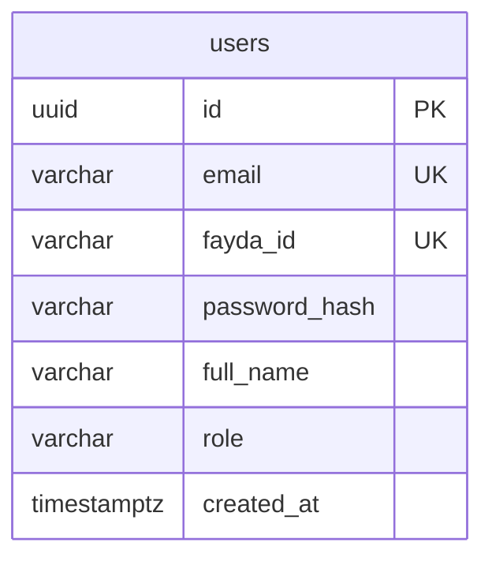
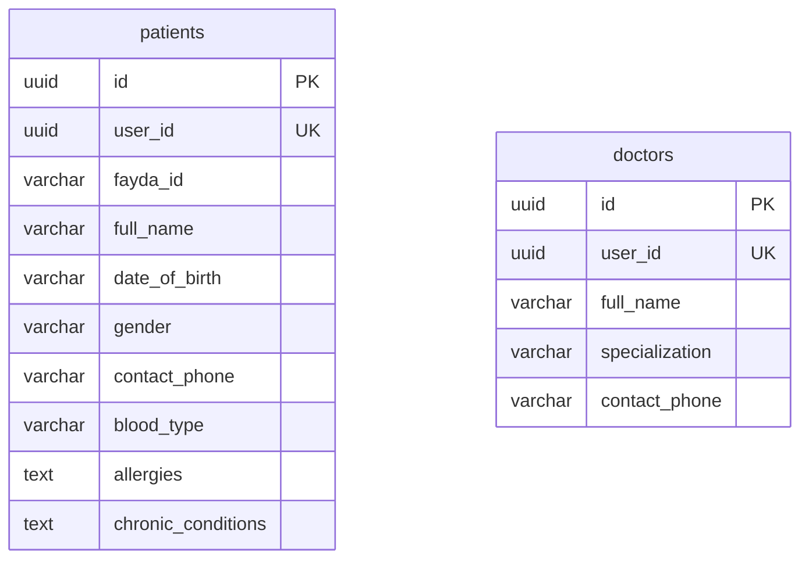
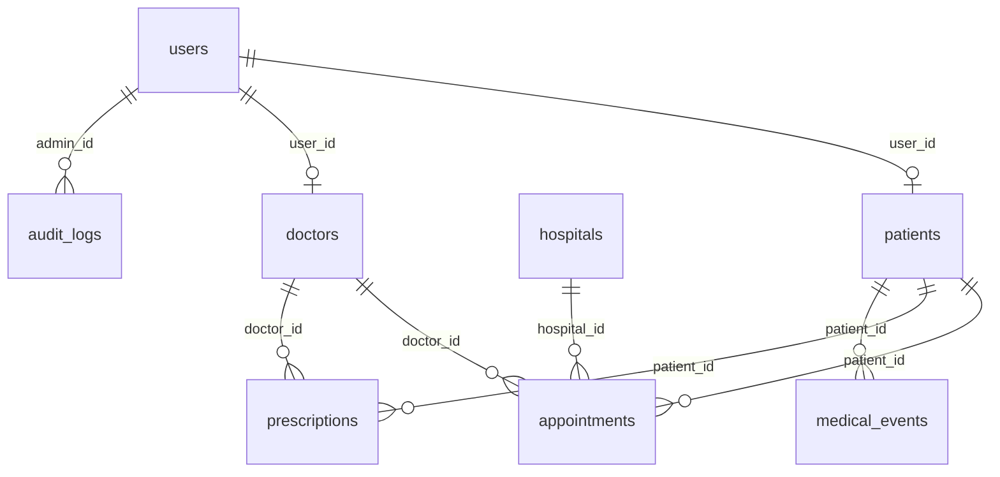

# 6. Database Documentation

TenaLink uses **seven separate PostgreSQL databases** (database-per-service pattern). Schema is managed by **Flyway** migrations in each service. `hibernate.ddl-auto` is `validate` (dev) or `none` (prod).

Manual seed data is available in `database/*.sql` at the repository root.

---

## Database Summary

| Database | Service | Tables |
|----------|---------|--------|
| `auth_db` | auth-service | `users` |
| `user_db` | user-service | `patients`, `doctors` |
| `appointment_db` | appointment-service | `appointments` |
| `pharmacy_db` | pharmacy-service | `prescriptions` |
| `medical_record_db` | medical-records-service | `medical_events` |
| `admin_db` | admin-service | `audit_logs`, `system_config` |
| `hospital_db` | hospital-service | `hospitals` |

---

## auth_db

### Table: `users`

| Column | Type | Constraints | Description |
|--------|------|-------------|-------------|
| `id` | UUID | PRIMARY KEY | User identifier |
| `email` | VARCHAR(255) | NOT NULL, UNIQUE | Login email |
| `fayda_id` | VARCHAR(255) | UNIQUE, nullable | National ID login alternative |
| `password_hash` | VARCHAR(255) | NOT NULL | BCrypt hash |
| `full_name` | VARCHAR(255) | NOT NULL | Display name |
| `role` | VARCHAR(255) | NOT NULL | e.g. `ROLE_PATIENT`, `ROLE_PROVIDER`, `ROLE_ADMIN`, `ROLE_SUPER_ADMIN` |
| `created_at` | TIMESTAMPTZ | NOT NULL, default NOW() | Account creation time |

**Indexes:** `idx_user_role` on `role`

**Migrations:** `V1__initial_schema.sql`

---

## user_db

### Table: `patients`

| Column | Type | Constraints | Description |
|--------|------|-------------|-------------|
| `id` | UUID | PRIMARY KEY | Patient record ID |
| `user_id` | UUID | NOT NULL, UNIQUE | Links to `auth_db.users.id` |
| `fayda_id` | VARCHAR(255) | NOT NULL | National ID |
| `full_name` | VARCHAR(255) | NOT NULL | Name |
| `date_of_birth` | VARCHAR(255) | NOT NULL | DOB string |
| `gender` | VARCHAR(255) | NOT NULL | Gender |
| `contact_phone` | VARCHAR(255) | NOT NULL | Phone |
| `blood_type` | VARCHAR(10) | nullable | Added V2 |
| `allergies` | TEXT | nullable | JSON/text array |
| `chronic_conditions` | TEXT | nullable | JSON/text |

**Note:** JPA entity `PatientEntity` includes `createdAt` but Flyway migrations do not define `created_at`. **Needs developer input** — possible schema drift.

### Table: `doctors`

| Column | Type | Constraints | Description |
|--------|------|-------------|-------------|
| `id` | UUID | PRIMARY KEY | Doctor record ID |
| `user_id` | UUID | NOT NULL, UNIQUE | Links to `auth_db.users.id` |
| `full_name` | VARCHAR(255) | NOT NULL | Name |
| `specialization` | VARCHAR(255) | NOT NULL | Medical specialty |
| `contact_phone` | VARCHAR(255) | NOT NULL | Phone |

**Note:** JPA entity `DoctorEntity` includes `createdAt` not in Flyway V1.

**Migrations:** `V1__initial_schema.sql`, `V2__add_patient_fields.sql`

---

## appointment_db

### Table: `appointments`

| Column | Type | Constraints | Description |
|--------|------|-------------|-------------|
| `id` | UUID | PRIMARY KEY | Appointment ID |
| `patient_id` | UUID | NOT NULL | References user_db.patients.id |
| `doctor_id` | UUID | NOT NULL | References user_db.doctors.id |
| `hospital_id` | VARCHAR(255) | NOT NULL | References hospital_db.hospitals.id (was UUID in V1, VARCHAR in V3) |
| `scheduled_at` | TIMESTAMPTZ | NOT NULL | Scheduled datetime |
| `status` | VARCHAR(255) | NOT NULL | e.g. `SCHEDULED`, `COMPLETED`, `CANCELLED` |
| `patient_name` | VARCHAR(255) | nullable | Denormalized display (V2) |
| `doctor_name` | VARCHAR(255) | nullable | Denormalized display (V2) |
| `hospital_name` | VARCHAR(255) | nullable | Denormalized display (V2) |
| `reason` | TEXT | nullable | Visit reason (V2) |
| `date` | VARCHAR(50) | nullable | Date string for UI (V2) |
| `time` | VARCHAR(50) | nullable | Time string for UI (V2) |

**Indexes:** `idx_appt_doctor_id`, `idx_appt_patient_id`

**Migrations:** `V1__initial_schema.sql`, `V2__add_appointment_fields.sql`, `V3__update_hospital_id_type.sql`

---

## pharmacy_db

### Table: `prescriptions`

| Column | Type | Constraints | Description |
|--------|------|-------------|-------------|
| `id` | UUID | PRIMARY KEY | Prescription ID |
| `patient_id` | UUID | NOT NULL | Patient reference |
| `doctor_id` | UUID | NOT NULL | Doctor reference |
| `medication` | VARCHAR(255) | NOT NULL | Drug name |
| `dosage` | VARCHAR(255) | NOT NULL | Dosage instructions |
| `prescribed_at` | TIMESTAMPTZ | NOT NULL | Prescription time |
| `status` | VARCHAR(255) | NOT NULL | Prescription status |

---

## medical_record_db

### Table: `medical_events`

| Column | Type | Constraints | Description |
|--------|------|-------------|-------------|
| `id` | UUID | PRIMARY KEY | Event ID |
| `patient_id` | UUID | NOT NULL | Patient reference |
| `hospital_id` | UUID | nullable | Hospital reference (V2 made nullable) |
| `author_id` | UUID | NOT NULL | Author (typically doctor user/doctor id) |
| `timestamp` | TIMESTAMPTZ | NOT NULL | Event time |
| `event_type` | VARCHAR(255) | NOT NULL | e.g. visit, lab, document types |
| `event_data` | TEXT | NOT NULL | JSON payload |

**Migrations:** `V1__initial_schema.sql`, `V2__make_hospital_id_nullable.sql`

---

## admin_db

### Table: `audit_logs`

| Column | Type | Constraints | Description |
|--------|------|-------------|-------------|
| `id` | UUID | PRIMARY KEY | Log entry ID |
| `admin_id` | UUID | NOT NULL | Acting admin user ID |
| `action` | VARCHAR(255) | NOT NULL | Action description |
| `target_resource` | VARCHAR(255) | NOT NULL | Affected resource |
| `timestamp` | TIMESTAMPTZ | NOT NULL | Event time |
| `actor_name` | VARCHAR(255) | nullable | Display name (V2) |
| `role` | VARCHAR(255) | nullable | Actor role (V2) |

**Index:** `idx_audit_timestamp` on `timestamp`

### Table: `system_config`

| Column | Type | Constraints | Description |
|--------|------|-------------|-------------|
| `id` | VARCHAR(255) | PRIMARY KEY | Config row ID |
| `config_key` | VARCHAR(255) | NOT NULL, UNIQUE | Configuration key |
| `config_value` | TEXT | NOT NULL | Configuration value |
| `description` | VARCHAR(255) | nullable | Human description |
| `updated_at` | TIMESTAMPTZ | NOT NULL | Last update |

**Migrations:** `V1__initial_schema.sql`, `V2__add_audit_log_actor_fields.sql`

---

## hospital_db

### Table: `hospitals`

| Column | Type | Constraints | Description |
|--------|------|-------------|-------------|
| `id` | VARCHAR(255) | PRIMARY KEY | Hospital ID (e.g. `h1`, `h-abc12345`) |
| `name` | VARCHAR(255) | NOT NULL | Hospital name |
| `specialty` | VARCHAR(255) | nullable | Primary specialty |
| `wait_time` | INTEGER | nullable | Estimated wait (minutes) |
| `address` | VARCHAR(255) | nullable | Physical address |
| `contact` | VARCHAR(255) | nullable | Contact phone |
| `latitude` | DOUBLE PRECISION | nullable | Geo latitude |
| `longitude` | DOUBLE PRECISION | nullable | Geo longitude |
| `icu_available` | BOOLEAN | NOT NULL, default false | ICU capability |
| `lab_available` | BOOLEAN | NOT NULL, default false | Lab on site |
| `pharmacy_available` | BOOLEAN | NOT NULL, default false | Pharmacy on site |
| `radiology_available` | BOOLEAN | NOT NULL, default false | Radiology on site |
| `ambulance_access` | BOOLEAN | NOT NULL, default false | Ambulance access |
| `glucose_available` | BOOLEAN | default false | Glucose testing |
| `created_at` | TIMESTAMPTZ | NOT NULL | Creation time |

**Index:** `idx_hospital_specialty` on `specialty`

---

## Cross-Database Logical Relationships

**No cross-database FK constraints exist.** Referential integrity is application-enforced.

---

## Migrations Summary

| Service | Migration files |
|---------|-----------------|
| auth-service | V1 |
| user-service | V1, V2 |
| appointment-service | V1, V2, V3 |
| pharmacy-service | V1 |
| medical-records-service | V1, V2 |
| admin-service | V1, V2 |
| hospital-service | V1 |

Flyway config: `baseline-on-migrate: true` in dev profiles.

---

## Seed Data

### Flyway seeders (`app.seed.enabled=true`)

| Seeder | Service | Creates |
|--------|---------|---------|
| `UserDataSeeder` | auth-service | Demo users; JDBC inserts into user_db patients |
| `HospitalSeeder` | hospital-service | 5 hospitals (h1–h5) |
| `AppointmentSeeder` | appointment-service | Sample appointments |
| `PrescriptionSeeder` | pharmacy-service | Sample prescriptions |
| `MedicalEventSeeder` | medical-records-service | Sample timeline events |
| `AdminDataSeeder` | admin-service | Sample audit logs and config |

### SQL import scripts (`database/`)

Idempotent TRUNCATE + INSERT scripts for all 7 databases. See `database/README_IMPORT.md`.

---

## Validation

Validation is primarily enforced at:

1. **JPA** — `@Column(nullable = false)`, unique constraints
2. **Service layer** — runtime checks (e.g., appointment date/time required)
3. **Frontend** — form validation on register (localStorage path) and book appointment pages

No Bean Validation (`@Valid`, `@NotNull`) annotations were found on controller request DTOs.
