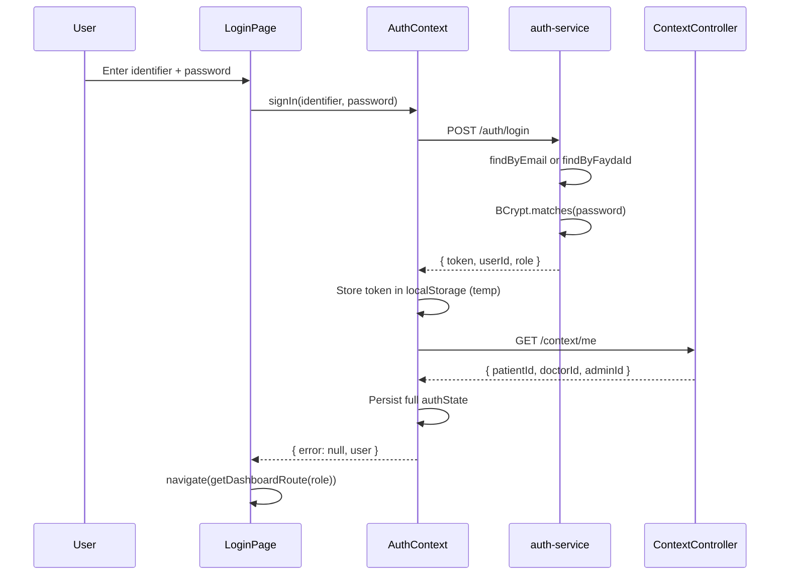

# 9. Authentication & Authorization

## Overview

TenaLink uses **stateless JWT authentication**. Tokens are issued by `auth-service` on login/register and stored client-side in `localStorage`. Role-based access is enforced on the **frontend** via `ProtectedRoute`; backend services largely **do not enforce** role or resource-level authorization.

---

## Login Flow



### Login identifier rules

- If `identifier` contains `@` → lookup by `email`
- Otherwise → lookup by `faydaId`

### JWT structure

| Claim | Value |
|-------|-------|
| `sub` | User UUID string |
| `role` | Backend role string (e.g. `ROLE_PATIENT`) |
| `iat` | Issued at |
| `exp` | 24 hours from issue |

**Algorithm:** HMAC-SHA (key from `jwt.secret`)

**Signing:** `AuthService.createResponse()` using JJWT 0.12.6

---

## Registration

### Backend path

`POST /auth/register` with `AuthDto.RegisterRequest`:
- Creates `UserEntity` in `auth_db`
- Normalizes role to `ROLE_*` prefix
- For `ROLE_PATIENT`: inserts row into `user_db.patients` via JDBC
- Returns JWT immediately (auto-login)

### Frontend path

`RegisterPage.jsx` does **not** call the backend. It:
1. Validates Fayda ID (12 digits) and password (≥8 chars)
2. Stores user in `localStorage` key `users`
3. Does not create a backend account

**This is a critical disconnect.** Production registration behavior **Needs developer input**.

---

## Password Handling

| Step | Implementation |
|------|----------------|
| Hashing | `BCryptPasswordEncoder` (Spring Security) |
| Storage | `users.password_hash` in `auth_db` |
| Verification | `passwordEncoder.matches()` on login |
| Plaintext | Never stored |

**Password policy:** Backend has no minimum length enforcement. Frontend register page requires 8+ characters (localStorage path only).

---

## Token Management

| Aspect | Implementation |
|--------|----------------|
| Storage | `localStorage.authState` (JSON) |
| Attachment | Axios interceptor in `apiClient.js` |
| Expiry | 24 hours; no refresh mechanism |
| Refresh tokens | **Not implemented** |
| Revocation | **Not implemented** — logout clears client storage only |

### 401 handling (frontend)

```javascript
// apiClient.js response interceptor
if (error.response?.status === 401) {
  localStorage.removeItem('authState');
  window.location.href = '/login';
}
```

---

## Identity Context

After login, `GET /context/me` resolves domain-specific IDs:

| Backend role | Context fields set |
|--------------|-------------------|
| `ROLE_PATIENT` | `patientId` (from `user_db.patients`) |
| `ROLE_PROVIDER` | `doctorId` (from `user_db.doctors`) |
| `ROLE_ADMIN`, `ROLE_SUPER_ADMIN` | `adminId` (= `userId`) |

**Not provided:** `hospitalId`, tenant scope, permissions list

`ContextController` returns 401 if `Authentication` is null; 500 on unexpected errors.

---

## Role-Based Permissions

### Backend roles (stored in DB)

| Role constant | Description |
|---------------|-------------|
| `ROLE_PATIENT` | Patient portal |
| `ROLE_PROVIDER` | Doctor portal |
| `ROLE_ADMIN` | Hospital admin portal |
| `ROLE_SUPER_ADMIN` | Super admin portal |

### Frontend roles (`constants/roles.js`)

| Frontend constant | Mapped from backend |
|-------------------|---------------------|
| `PATIENT` | `patient`, `ROLE_PATIENT` |
| `DOCTOR` | `doctor`, `provider`, `ROLE_PROVIDER` |
| `HOSPITAL_ADMIN` | `admin`, `hospital_admin`, `ROLE_ADMIN` |
| `SUPER_ADMIN` | `super_admin`, `ROLE_SUPER_ADMIN` |

Normalization in `AuthContext.normalizeRole()`.

### Route protection

`ProtectedRoute` (`components/shared/ProtectedRoute.jsx`):
1. Shows `LoadingScreen` while `isLoading`
2. Redirects to `/login` if no user
3. Redirects to role dashboard if `allowedRoles` mismatch

| Route prefix | Allowed role |
|--------------|--------------|
| `/patient/*` | `PATIENT` |
| `/doctor/*` | `DOCTOR` |
| `/admin/*` | `HOSPITAL_ADMIN` |
| `/super-admin/*` | `SUPER_ADMIN` |

### Authorization gaps

- Backend endpoints do not check roles (except JWT parsing on auth-service for `/context/me`)
- Any client with a valid JWT could call any endpoint
- Hospital admin APIs return platform-wide data
- No resource ownership checks (e.g., patient can only access own records) at API layer

---

## Security Mechanisms Summary

| Mechanism | Status |
|-----------|--------|
| JWT authentication | Implemented (issuance + client usage) |
| JWT validation on all services | **Only auth-service parses JWT** |
| Role-based API authorization | **Not implemented** |
| CSRF protection | Disabled on all services |
| CORS | Gateway `CorsWebFilter` |
| HTTPS | **Needs developer input** (deployment concern) |

---

## Middleware / Filters

### `JwtAuthenticationFilter` (auth-service only)

1. Skip `OPTIONS` requests
2. Extract `Bearer` token from `Authorization` header
3. Parse and validate JWT with `jwt.secret`
4. Set `SecurityContext` principal = userId, authority = role
5. On invalid token: log debug, continue without authentication

### Gateway CORS

Applied to all paths via `CorsWebFilter`.

---

## Session vs JWT

The system is **fully stateless** on the server. No server-side sessions. The legacy `localStorage` key `session` is cleared on logout but primary storage is `authState`.
