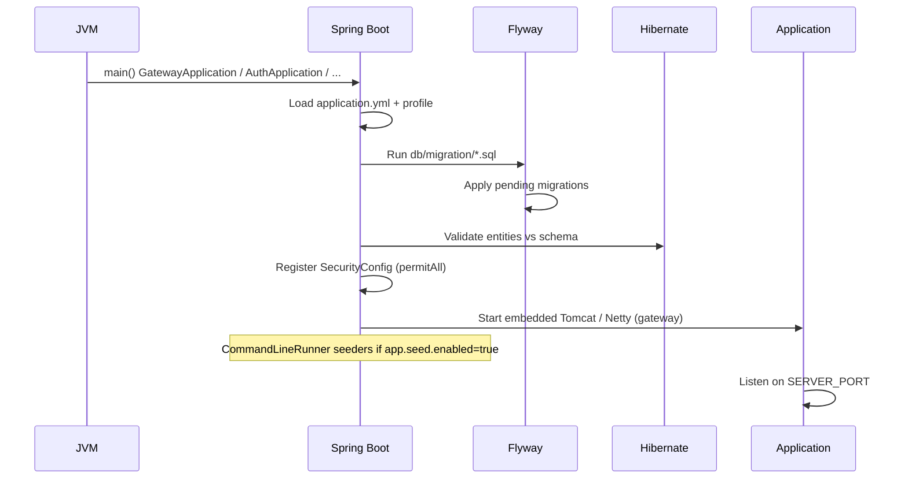

# 23. Code Walkthrough

## Application Startup

### Backend — per microservice



**Entry points:**

| Service | Main class |
|---------|------------|
| Gateway | `com.tenalink.gateway.GatewayApplication` |
| Auth | `com.tenalink.auth.AuthApplication` |
| User | `com.tenalink.user.Application` |
| Care workflow | `com.tenalink.care workflow.Application` |
| Pharmacy | `com.tenalink.pharmacy.Application` |
| Medical records | `com.tenalink.medicalrecords.Application` |
| Admin | `com.tenalink.admin.Application` |
| Hospital | `com.tenalink.hospital.Application` |

### Frontend

```
1. index.html loads /src/app/main.jsx
2. ReactDOM.createRoot renders <App />
3. App mounts AuthProvider → LanguageProvider → AppRouter
4. AuthProvider reads localStorage.authState
5. If token present without domain IDs → GET /context/me
6. Router matches URL → ProtectedRoute or public auth page
7. Layout renders sidebar + page component
8. Page useEffect fetches data from API
```

---

## Dependency Loading

### Backend

Spring Boot auto-configuration loads:
- DataSource from `spring.datasource.*`
- JPA EntityManagerFactory scanning `@Entity` in package
- Repositories via `@EnableJpaRepositories` (implicit)
- Security filter chain from `SecurityConfig` `@Bean`
- Flyway from classpath migrations

`UserDbConfig` (where present) creates secondary `DataSource` for `user_db`.

### Frontend

Vite bundles ES modules. No code-splitting configuration beyond Vite defaults. All routes imported statically in `Router.jsx`.

---

## Configuration Loading Order (Backend)

1. `application.yml` — profile activation, port, JPA defaults
2. `application-{profile}.yml` — dev or prod overrides
3. Environment variables override YAML in prod
4. `application.properties` (user-service only) — may merge additionally

---

## Request Lifecycle (Authenticated API Call)

```
1. User action in React component
2. API module calls apiClient.get/post/...
3. Request interceptor adds Authorization: Bearer <token>
4. HTTP → Gateway :8080
5. CorsWebFilter adds CORS headers
6. Gateway routes to service by path prefix
7. Target service SecurityConfig: permitAll (no block)
8. Controller method invoked
9. Service → Repository → PostgreSQL
10. Response JSON → Gateway → Client
11. Component setState with response data
```

For `GET /context/me` only:
- Request hits auth-service
- `JwtAuthenticationFilter` parses JWT → SecurityContext
- `ContextController.me(Authentication)` requires non-null auth

---

## Data Lifecycle

### User registration (backend path)

```
RegisterRequest → UserEntity → auth_db.users
  → (if PATIENT) JDBC INSERT → user_db.patients
  → JWT returned
```

### Care workflow creation

```
CreateRequest → Care workflowEntity
  → parse date/time → scheduledAt
  → status = SCHEDULED
  → legacy placeholder_db.care workflows
```

### Medical event

```
CreateRequest → MedicalEventEntity
  → eventData as JSON text
  → medical_record_db.medical_events
```

### Audit log

```
CreateRequest → AuditLogEntity
  → timestamp = now (default)
  → admin_db.audit_logs
  (no update/delete in normal API)
```

---

## Shutdown

All services configure graceful shutdown:

```yaml
server:
  shutdown: graceful
spring:
  lifecycle:
    timeout-per-shutdown-phase: 30s
```

On SIGTERM, Spring Boot completes in-flight requests before stopping (up to 30s).

Frontend: no special teardown — browser tab close ends session; token remains in localStorage until logout.

---

## Initialization Timeline (Local Dev)

| Step | Action |
|------|--------|
| 1 | Start PostgreSQL with 7 databases |
| 2 | (Optional) Import `database/*.sql` |
| 3 | Start 7 domain services — Flyway migrates |
| 4 | Start gateway |
| 5 | `npm run dev` frontend |
| 6 | Login with seed credentials |

**Total processes:** 1 Postgres + 8 Java + 1 Vite dev server = 10 processes.
